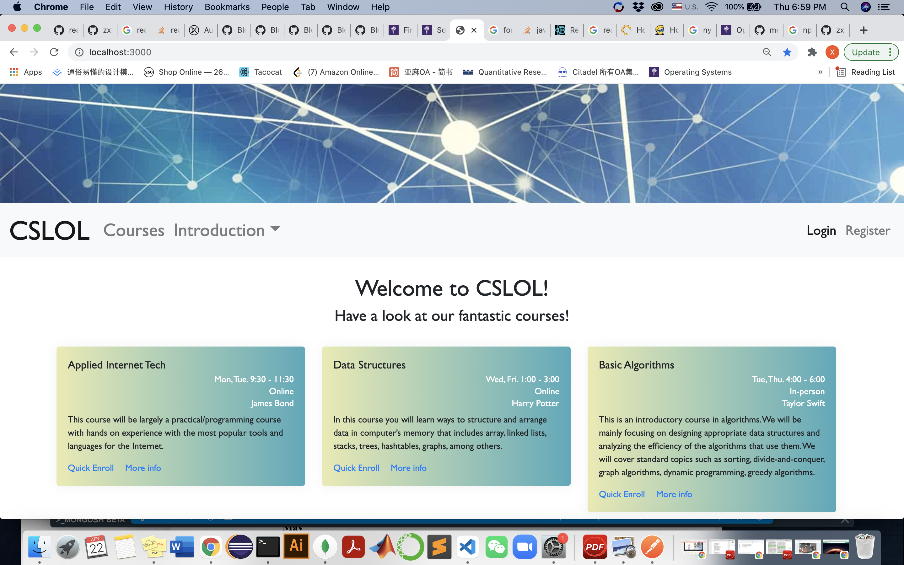
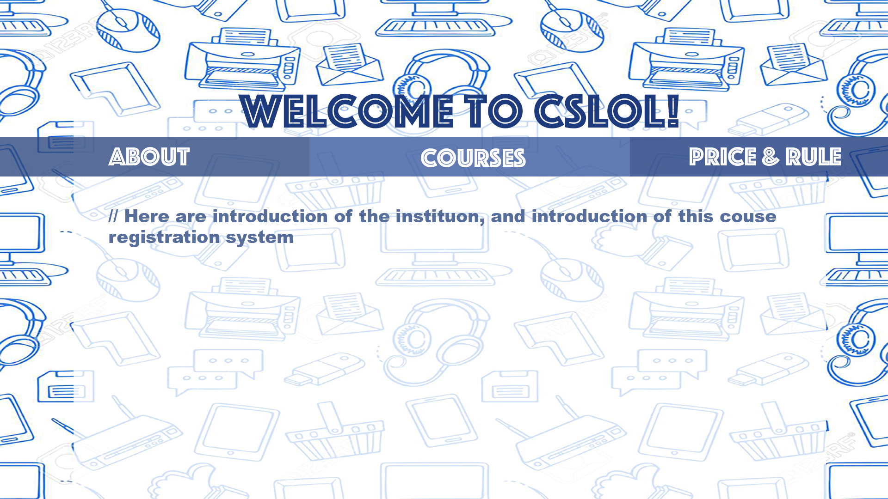
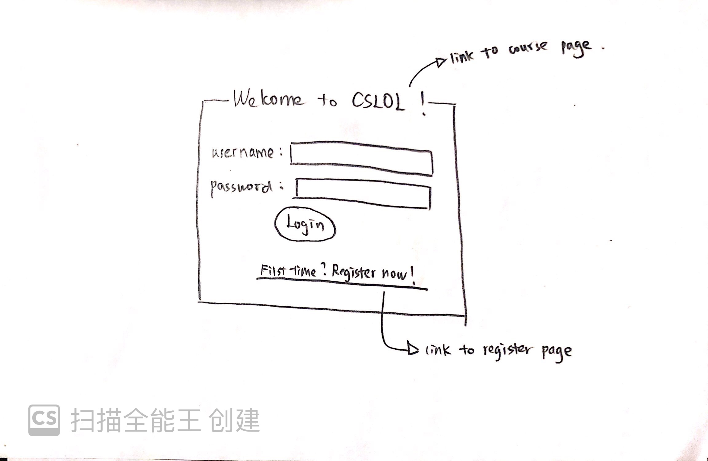
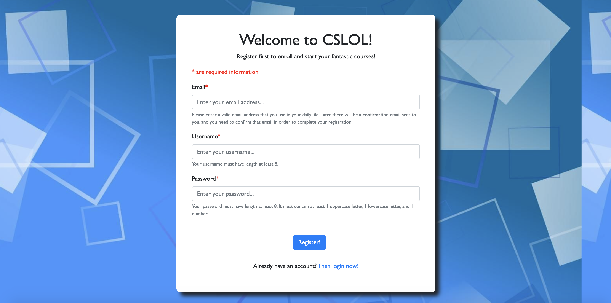
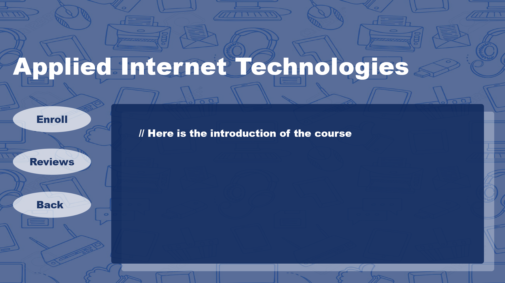
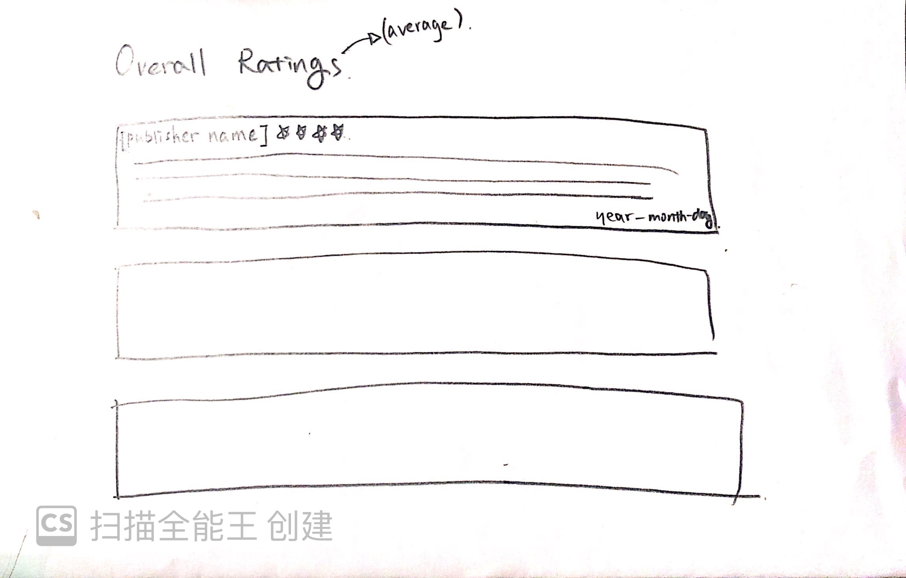
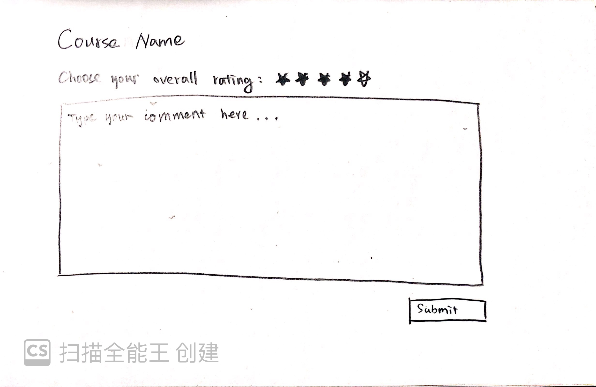
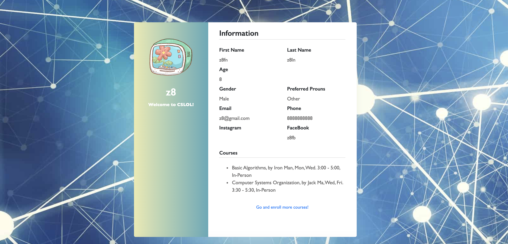
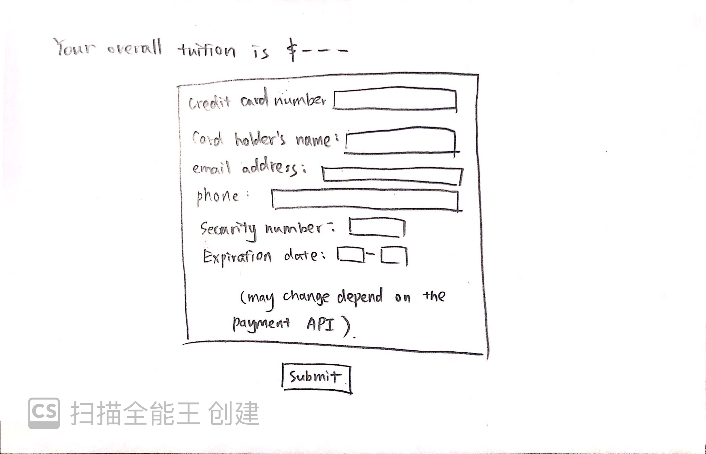
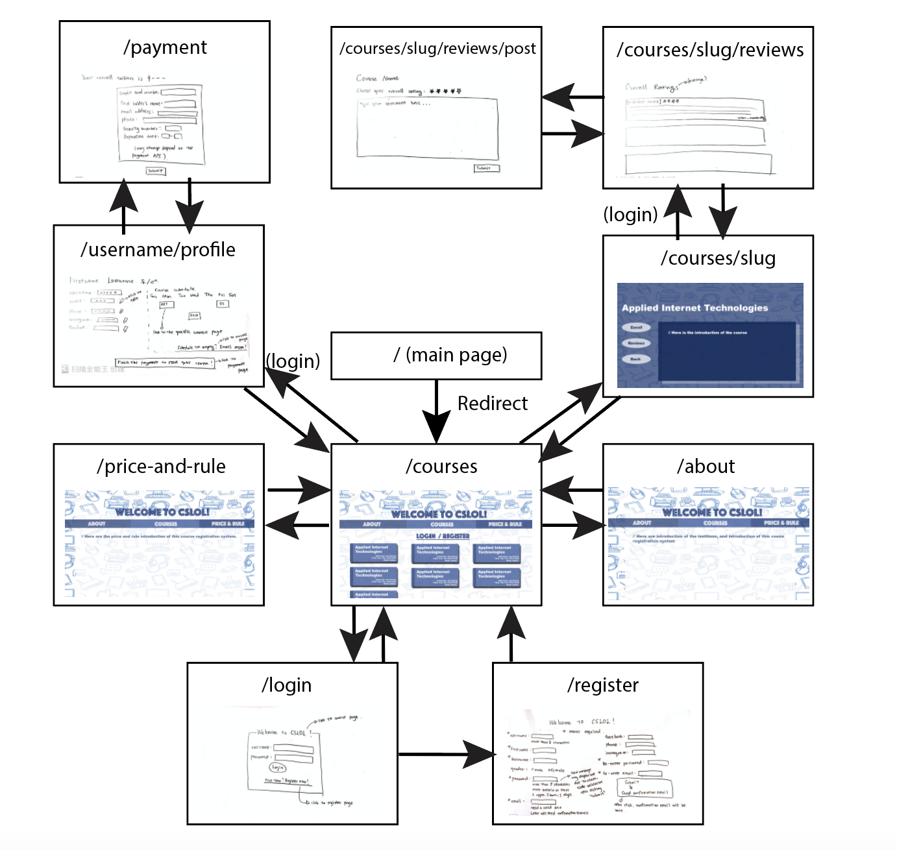

# CSLOL

## Overview
CSLOL is a web application which serves for a **mocking** "non-school school" educational institution that specifically teaches computer science. Here, the "non-school school" means that on one hand, it provides high-quality computer science courses, either online or offline, and contains high-quality teaching resources that would take responsibility of designing couress and assignments, grading homework, making exams, etc. On the other hand, different from official schools, it has not requirement on students' previous educational background, and is open to people at all ages. It has less requirements than official schools, but provides as good education as official schools!

**And CSLOL serves as the course registration web application** for this mocking education institution. There is no educational background requirement users, and there is no entrance examinations. CSLOL contains very detailed information for all computer science courses provided by the institution, including course description, information of instructors, and reviews of each course made by other users. Users are able to browse all courses' information as a guest user, but are required to register an account using a valid email address before formally enroll in any course. 

After registration and filling out some basic personal information, users are able to enroll/swipe/drop any course they want. They are free to make their own study plan and course schedule, and are free to join in class whenever they want. They are also free to do reviews for any course they have taken or finished. Users are allowed to formally start their course, and would receive further instruction and pass to join the course after finishing the payment. All courses have same price. And users are asked to pay per course. 

**Note that all above -- the institution, course information, instructors' information, etc -- are all mocked.**

## Data Model
The application will store User, Course, and Review.

* User can have an array of Course (via reference, and would be populated by Course name).

* Course can have an array of Review (via reference, and would be populated by Review ratings).

* Review has a publisher (via reference to User, and would be populated by username), and a reviewed course (via reference, and would be populated by Course name).

An example of User:

```
{
    username: 'zxtariel',  
    firstname: 'Xintong',
    lastname: 'Zhu',
    gender: 'female',//optional
    password: //hash,
    email: 'zxt@gmail.com',
    confirmed: true,
    courses: ['Theory of Computation', 'Computer System Organizations', 'Applied Internet Technologies'],
    phone: '9283839999', //optional
    instagram: 'zxtlll', //optional
    facebook: 'zxtzzz' //optional
}
```

An example of Course:

```
{
    name: 'Applied Internet Technologies',
    description: 'Introduce javascript, authentication, html, etc, which are useful for creating web applications.',
    instructor: 'Joe Veroza',
    time: 'Tue, Thu. 9:30-10:45',
    mode: 'online',
    location: 'N/A',
    reviews: [5, 5, 4, 5, 5, 4]
}
```

An example of Review:

```
{
    publisher: 'ls3',
    content: 'Brilliant class! Very thorough introduction, and now I can make a web app on my own!.' //optional
    ratings: 5,
    course: 'Applied Internet Technologies'
}
```

### [Link to the draft of models](./backend/models)

## Wireframes

**Some are finished in photoshop, and some are finished in hand drawings.**

### / - main page, redirect to /courses



### /courses - display all courses and brief info


### /about - contains information about the educational institution



### /price-and-rule - contains information about the prices, tuition, and tutorial of this web application (course registration)


### /login - log in page, prompt user for username and password



### /register - register page, prompt user for some basic personal information, and email address for later confirmation email



### /courses/slug - page for specific course that contains information of that course, reviews, and enroll option. slug would be the course's name.



### /courses/slug/reviews - contains all reviews (ratings and comments) of a specific course specified by the slug (the course's name)



### /courses/slug/reviews/post - post a review to a specific course (required login status)



### /username/profile - personal profile of current user. (May contain 'drop' utility, which is not displayed now so far.)



### /payment - payment page (may change depending on which API to use finally)



## Site Map
**The following site map is generated in illustrator.**



### [Link to the cite map](./documentation/siteMap.pdf)

## User Stories
* As non-register user, I can browse all courses and their basic info.
* As non-register user, I can browse the basic information of how to use this course registration application.
* As non-register user, I can register an account with a valid email address.
* As registered user, I can login.
* As login user, I can enroll any class on site.
* (As login user, I can drop any class I have previously enrolled.)
* As login user, I can pay for courses that I have enrolled.
* As login user, I can view and change some information in my profile.
* As login user, I can see reviews of a specific course.
* As login user, I can post a review to any course.

## Research Topics
* (4 points) React.js
    * Plan to have a thorough self-learning on React.js, so that I can use MERN stack (MongoDB, Express.js, React.js, and Node.js) to finish this project.
    * Plan to integrate some relatively fancier web pages, compared to those in assignments.
    * Plan to study how to use React.js along with Node.js to create web application.
* (3 points) Server side authentication: confirmation email
    * Plan to use either aws-amplify or Nodemailer to realize the confirmation functionality: after entering email address in registering process, the user needs to confirm their email address before formally being registered.
* (2 points) Client side authentication
    * Plan to do this on my own via printing out different kinds of error messages (e.g.: password format incorrect, invalid email address, username too short, etc) on the web page and re-prompt the user for input.
* (3 points) Use some payment API, such as Paypal.api, to realize payment functionality
    * Enable user to pay for their courses online.
