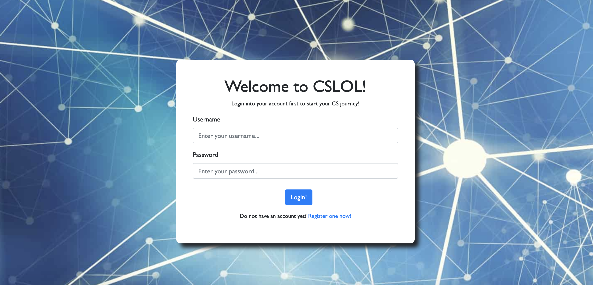
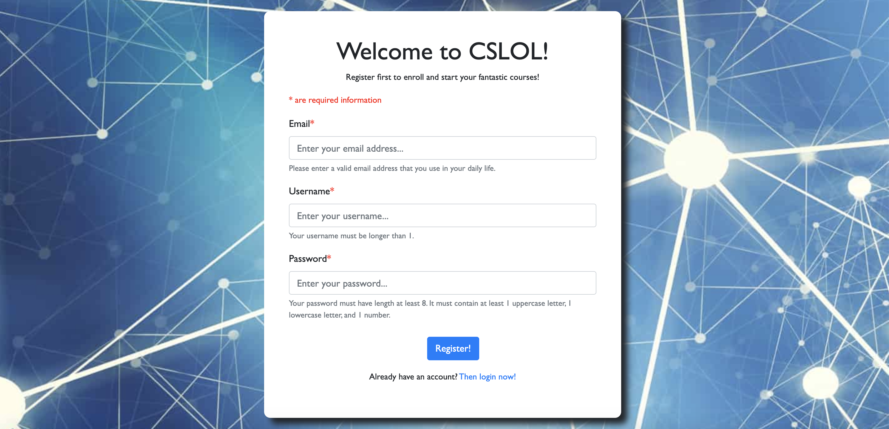
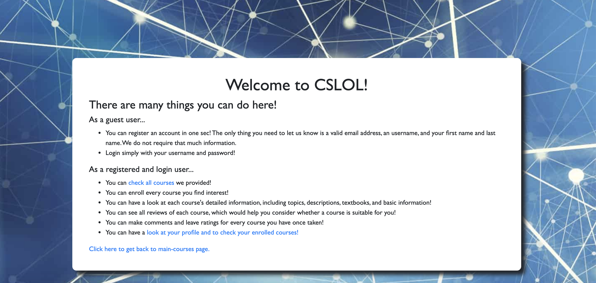

# CSLOL

##  `Need to login first to access other pages.`
In order to access other pages, along with forms, you need to first login through page '/', or register through page '/register'.

## Update on Milestone
### Milestone #4 (final submission)
[Here are links to the github repo that contains research progress on React.js and React-Bootstrap](src/components)

Here are links to the third form for posting reviews to a specific course

* [Client side and frontend in react.js](src/components/reviews.component.js)
* [Backend router](backend/routes/review.js)

Here are links to the client side validation

* [Register](src/components/register.component.js)
* [Complete user profile (Age and Phone)](src/components/complete-info.component.js)


### Milestone #3
Here are links to the github repo that contains research progress on using JWT to do user authentication

* [Backend](backend/middlewares)
* [routes](backend/routes/user.js)
* [Login component](src/components/login.component.js)
* [Register component](src/components/register.component.js)
* [Authentication context](src/context)

[Here is a link to the github repo that contains research progress on React.js and Bootstrap](src/components)

[Here is a link to the github repo that contains research progress on using axios to connect backend and frontend](src/components)

[Here is a link to the second form (that is not registration or login](src/components/enroll.component.js) (Please follow the instructions I wrote in the submit-assignment-form to test this form)

Main courses page, quick enrollment page are finished.

### Milestone #2
[Here is a link to the github repo that contains research progress on React.js and Bootstrap](src/components)

[Here is a link to the form (that is not registration or login)](src/components/complete-info.component.js)

Login, Registration, Complete-Profile-Info, and Profile pages are finished.

## Overview
CSLOL is a web application which serves for a **mocking** "non-school school" educational institution that specifically teaches computer science. Here, the "non-school school" means that on one hand, it provides high-quality computer science courses, either online or offline, and contains high-quality teaching resources that would take responsibility of designing couress and assignments, grading homework, making exams, etc. On the other hand, different from official schools, it has not requirement on students' previous educational background, and is open to people at all ages. It has less requirements than official schools, but provides as good education as official schools!

**And CSLOL serves as the course registration web application** for this mocking education institution. There is no educational background requirement users, and there is no entrance examinations. CSLOL contains very detailed information for all computer science courses provided by the institution, including course description, information of instructors, and reviews of each course made by other users. Users are able to browse all courses' information as a guest user, but are required to register an account using a valid email address before formally enroll in any course. 

After registration and filling out some basic personal information, users are able to enroll/swipe/drop any course they want. They are free to make their own study plan and course schedule, and are free to join in class whenever they want. They are also free to do reviews for any course they have taken or finished. Users are allowed to formally start their course, and would receive further instruction and pass to join the course after finishing the payment. All courses have same price. And users are asked to pay per course. 

**Note that all above -- the institution, course information, instructors' information, etc -- are all mocked.**

## Data Model
The application will store User, Course, and Review.

* User can have an array of Course (via reference, and would be populated).

* Course can have an array of Review (via reference, and would be populated).

* Review has a publisher (via reference to User, and would be populated), and a reviewed course (via reference, and would be populated).

An example of User:

```
{
    username: 'zxtariel',  
    firstname: 'Xintong', //optional
    lastname: 'Zhu', //optional
    gender: 'female',//optional
    password: //hash,
    email: 'zxt@gmail.com',
    confirmed: true, //default false
    courses: ['Theory of Computation', 'Computer System Organizations', 'Applied Internet Technologies'],
    phone: '9283839999', //optional
    instagram: 'zxtlll', //optional
    facebook: 'zxtzzz' //optional
}
```

An example of Course:

```
{
    name: 'Applied Internet Technologies',
    description: 'Introduce javascript, authentication, html, etc, which are useful for creating web applications.',
    instructor: 'Joe Veroza',
    time: 'Tue, Thu. 9:30-10:45',
    mode: 'online',
    location: 'N/A',
    reviews: [] // will be Review object and will be populated
    slug: applied-internet-tech,
    students: [_id1, _id2, _id3],
    emailList: [s1@nyu.edu, s2@nyu.edu, s3@yahoo.com],
    expectation: ["I hope to learn more about Socket", "I hope this course can have a bit less homework"],
    topics: ["Node.js", "React.js", "MongoDB", "socket.io],
    textbooks: ["Exploring ES6 by Axel Rauschmayer", "Speaking JavaScript by Axel Rauschmayer"]
}
```

An example of Review:

```
{
    publisher: '', // will be User object and will be populated
    content: 'Brilliant class! Very thorough introduction, and now I can make a web app on my own!.' //optional
    ratings: 5,
    course: '' // will be Course object and will be populated
}
```

### [Link to the draft of models](./backend/models)

## Wireframes
### / --> Login page. Users need to login first to continue


### /register --> Register page. Users are prompted for email, username, and password. Client side validation included


### /complete-user-information --> After user's first-time-login, this page is called after the login. Users are prompted for some basic infomation, but only first name and last name are required


### /main-courses --> Include all courses and their basic info, along with access to user's profile


### /enroll/:slug --> Enroll page. Users are prompted for a commonly used contact email and expectation to the course he/she intends to enroll in, along with the confirmation page.


### /main-courses/:slug --> Specific course page. Include detailed course information


### /main-courses/:slug/review --> Reviews page. All reviews are displayed for specific course, along with access to post a new review


### /profile --> Profile page. Include information user has entered in /complete-user-information page, along with all enrolled courses


### /introduction --> Introduction of CSLOL


### /actions --> User story page


### /reminder --> Contain things user needs to keep in mind


### /error --> A small error page that notifying user he/she needs to login first in order to access current url page


## Site Map


### [Link to the site map](./documentation/site-map.png)

## User Stories
* As non-register user, I can register an account.
* As registered user, I can login.
* As login user, I can enroll any class on site.
* As login user, I can complete user information to enrich my profile.
* As login user, I can view my profile along with all enrolled courses.
* As login user, I can see detailed information of each course.
* As login user, I can see reviews of a specific course.
* As login user, I can see average ratings of each course.
* As login user, I can post a review to any course.
* As login user, I can see introduction, user story, and reminder for this web app.

## Research Topics
* (6 points) React.js
    * Having a thorough self-learning on React.js, so that I can use MERN stack (MongoDB, Express.js, React.js, and Node.js) to finish this project.
    * Integrate some relatively fancier web pages, compared to those in assignments.
    * Use React.js along with Node.js to create web application.
* (2 points) Use JWT to do user authentication and store information for each user
* (1 point) Server side validation using jwt token on login page ('/').
* (1 point) Client side validation using React.js on register page ('/register') and complete user information page ('/complete-user-information').
* (2 points) Bootstrap
    * Using bootstrap for some frontend elements decorations, such as forms and buttons.
* (2 points) Use Axios to connect backend and frontend (React.js and Node.js)

14 points total out of 8.

## [Link to Initial Main Project File](./backend/server.js)

## Anotation / Refereces
* [Tutorial of Nodemailer](https://nodemailer.com/about/)
* [Tutorial of React.js](https://www.youtube.com/watch?v=Ke90Tje7VS0)
* [Tutorial of MERN Stack](https://www.youtube.com/watch?v=7CqJlxBYj-M&t=5568s)
* [Markdown language cheatsheet](https://www.markdownguide.org/cheat-sheet/)
* [Tutorial for bootstrap in react.js](https://react-bootstrap.netlify.app/components/forms/)
* [Tutorial for AWS-Amplify for user authentication](https://blog.logrocket.com/authentication-react-apps-aws-amplify-cognito/)
* [Tutorial for AWS-Amplify for user authentication](https://cloud.google.com/api-gateway/docs/authenticating-users-jwt#:~:text=To%20authenticate%20a%20user%2C%20a,API%20to%20process%20the%20authentication.)
* [Tutorial for handling react events](https://reactjs.org/docs/handling-events.html)
* [Tutorial of JWT user authentication](https://itnext.io/authentication-in-mern-stack-using-jwt-25c966027f77)
* [Tutorial of axios regarding with authorization header](https://flaviocopes.com/axios-send-authorization-header/)
* [Tutorial of axios](https://zetcode.com/javascript/axios/)